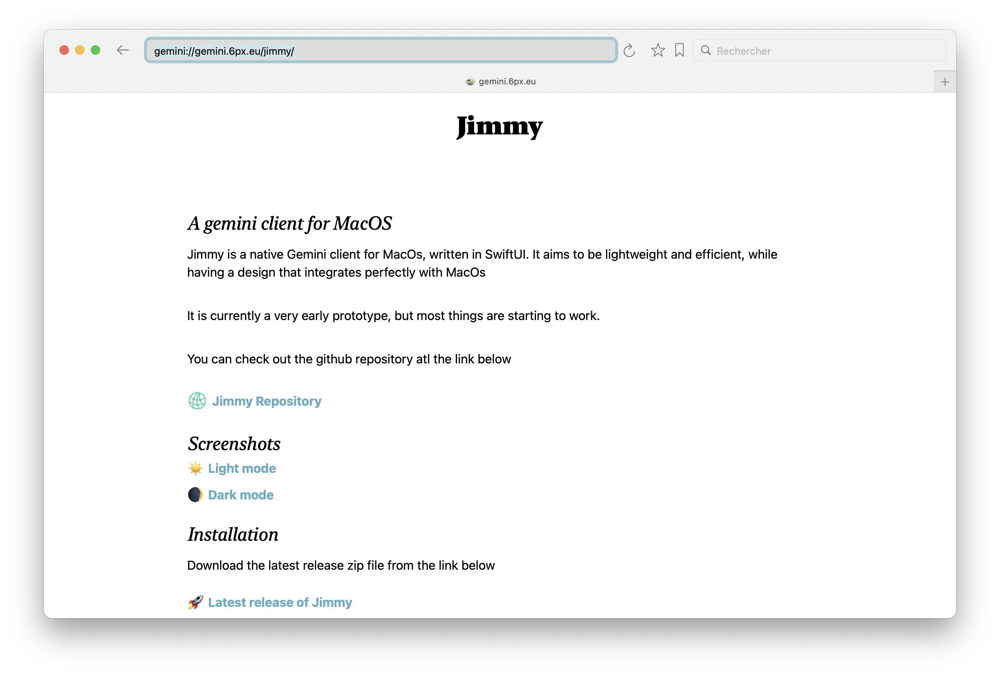
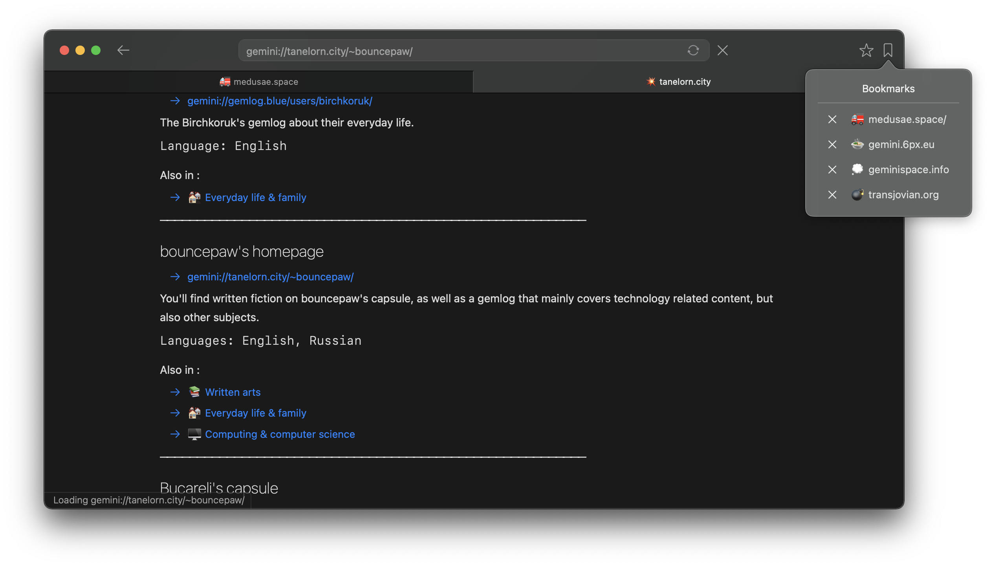

#  Jimmy

## A gemini client for MacOS

Jimmy is a native [gemini](https://en.wikipedia.org/wiki/Gemini_(protocol)) client for MacOs, written in SwiftUI. It aims to be lightweight and efficient, while having a design that integrates perfectly with MacOs

It is currently a very early prototype, but most things are starting to work.

What does work, also known as:

## Features

- Multiple tabs
- Display of text, links and images
- Trigger download of unknown file types
- Open unknown protocol by delegating to OS
- Save and clear history
- Search through history while typing in the URL bar
- Emoji favicon for each domain (either though favicon.txt or autogenerated)
- Search through content on each tab
- Asks for validation of self signed certificates
- Show a red lock for self-signed certificates and a green one for fully valid certificates
- And more planned, see [the issues](https://github.com/jfoucher/Jimmy/issues)

## Screenshots

*Light mode*

*Dark mode*

## Installation

Download the latest release zip file from [here](https://github.com/jfoucher/Jimmy/releases/latest), unzip and place the app in your Applications folder.

## Development log
I have a [devlog on gemini]
